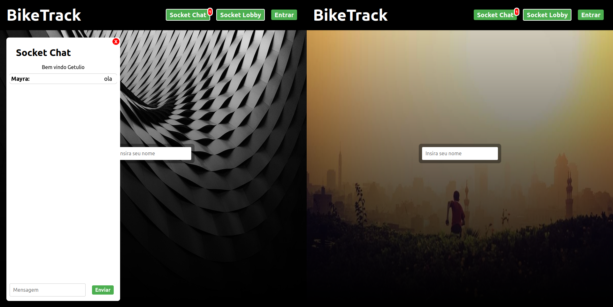
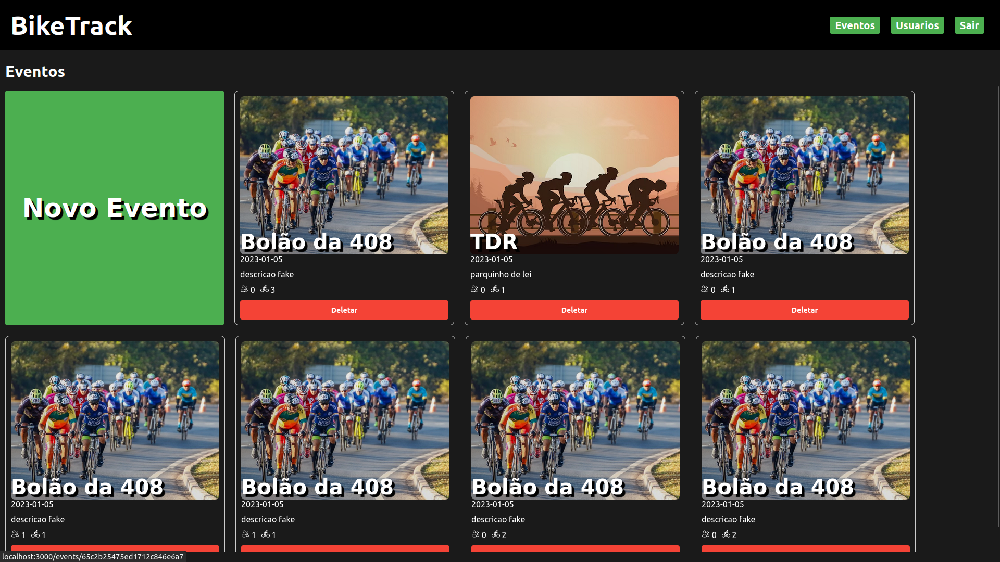
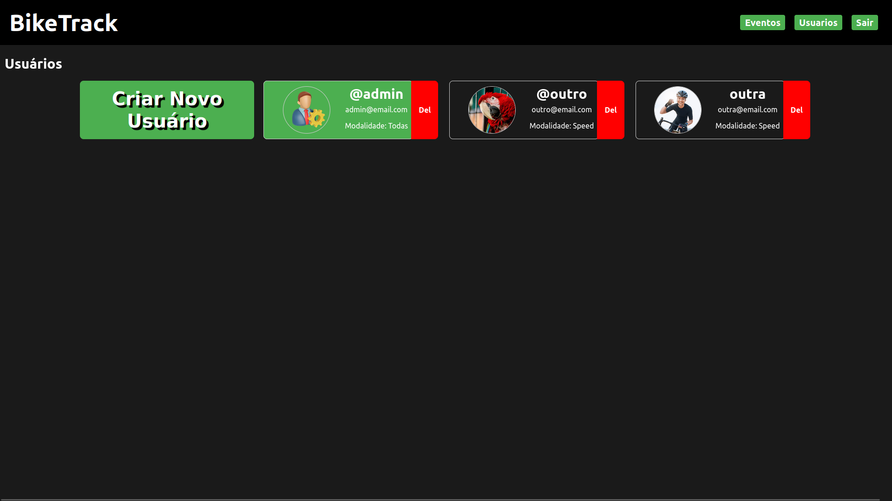

# BikeTrack Telemetry

BikeTrack Telemetry is a web application built to track telemetry data from bicycles. It provides a platform for cyclists to monitor and analyze their rides, including metrics such as speed, distance, and route information.

## Getting Started

To run this project locally, you'll need to have Node.js, React, and MongoDB installed on your machine.

### Backend Setup

1. Navigate to the `backend` directory.
2. Install dependencies using `npm install`.
3. Start the server using `npm start`.
4. The server should now be running on `http://localhost:5000`.

### Frontend Setup

1. Navigate to the `frontend` directory.
2. Install dependencies using `npm install`.
3. Start the development server using `npm start`.
4. The frontend should now be accessible at `http://localhost:3000`.

## Technologies Used

- Node.js
- React
- MongoDB

## Features

- Track and monitor telemetry data from bicycle rides.
- Analyze ride metrics such as speed, distance, and route information.
- User-friendly interface for easy navigation and data visualization.

## Screenshots

<!-- You can add more screenshots here -->

## Installation

To install this project, follow these steps:

1. Clone the repository.
2. Install backend dependencies using `npm install` in the `backend` directory.
3. Install frontend dependencies using `npm install` in the `frontend` directory.
4. Start the backend server using `npm start`.
5. Start the frontend development server using `npm start`.

## Contributing

Contributions are welcome! If you find any bugs or have suggestions for improvements, please open an issue or submit a pull request.

## License

This project is licensed under the [MIT License](LICENSE).
